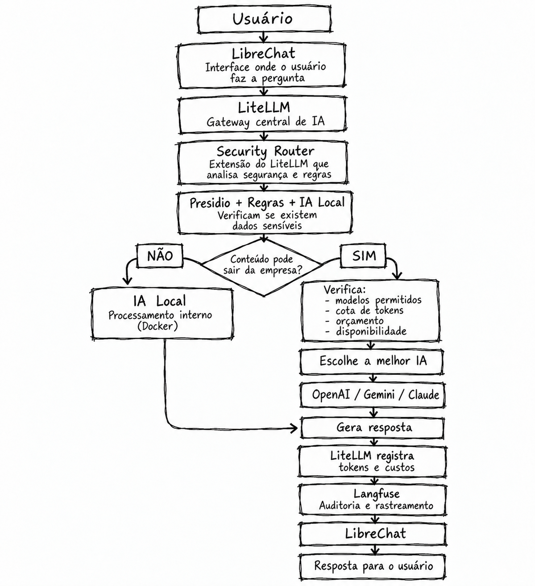

# Corporate AI Platform (SGChat)

Plataforma corporativa self-hosted para uso seguro, governado e auditável de IA: um portal de chat
(LibreChat) que acessa modelos locais e externos exclusivamente por um AI Gateway (LiteLLM), com
observabilidade (Langfuse), detecção de PII (Presidio) e IA Local (Ollama). Tudo roda em Docker.

## Fluxograma geral resumido



## Pré-requisitos

- Docker 29+ com Docker Compose v2 — nada mais é instalado no host.
- ~12 GB de RAM livres para a stack completa e ~15 GB de disco (imagens + modelo).
- `openssl` e `python3` no host (usados pelos scripts auxiliares).
- Opcional: GPU NVIDIA + `nvidia-container-toolkit` para acelerar a IA Local
  ([instalação](docs/architecture.md#instalação-do-nvidia-container-toolkit-ubuntu-requer-sudo)).
- Opcional: chave da API Gemini (Google AI Studio) para o modelo `gemini`.

## Subir a plataforma

```bash
git clone <url-do-repositório> && cd SGChat
scripts/init-env.sh          # cria o .env a partir do .env.example e gera todos os secrets
```

Edite o `.env`:

- `GEMINI_API_KEY=` — sua chave do Gemini (opcional; sem ela o modelo `gemini` retorna erro).
- `COMPOSE_FILE=docker-compose.yml:docker-compose.gpu.yml` — somente se o host tiver GPU NVIDIA
  com `nvidia-container-toolkit` (padrão: CPU).

```bash
docker compose up -d
scripts/healthcheck.sh       # aguarde até todos os serviços aparecerem como healthy
```

A **primeira subida demora** (vários minutos): download de ≈8 GB de imagens e do modelo
`qwen2.5:3b` (≈2 GB). As seguintes levam menos de 1 minuto.

## Criar usuários e acessar

O auto-registro está desabilitado; usuários são criados pelo administrador:

```bash
scripts/create-user.sh maria@empresa.local "Maria Silva" maria.silva
```

A senha gerada é exibida no terminal (ou, com `--save` no fim, gravada em `.test-users`, arquivo
local ignorado pelo git). Defina uma senha própria com `PASSWORD=... scripts/create-user.sh ...`.

| Interface | Endereço | Acesso |
|---|---|---|
| Portal de chat (LibreChat) | http://localhost:3080 | usuários criados acima |
| Langfuse (observabilidade) | http://localhost:3000 | `LANGFUSE_INIT_USER_EMAIL` / `LANGFUSE_INIT_USER_PASSWORD` do `.env` |
| Portal de auditoria (Fase 9) | http://localhost:3090 | perfis AUDITOR / MASTER_AUDITOR ([docs/audit.md](docs/audit.md)) |
| AI Gateway (LiteLLM, só loopback) | http://127.0.0.1:4000 | `LITELLM_MASTER_KEY` do `.env` |

Modelos disponíveis no portal: **`auto`** (o gateway escolhe), **`local-ai`** (IA Local, dados não
saem da empresa) e **`gemini`** (Google, externo).

## Controle de acesso a modelos

O que cada usuário pode usar é definido por grupos em `litellm/policies/model-access.yaml` e aplicado
pelo gateway (HTTP 403 `MODEL_ACCESS_DENIED` para modelos não permitidos). Usuários não listados caem
no grupo `USER`. Edite o arquivo e a mudança vale na próxima requisição, sem reiniciar.

## Segurança de conteúdo

Toda mensagem é classificada (`PUBLIC`, `INTERNAL`, `CONFIDENTIAL`, `RESTRICTED`) pelo Security Router
com regras em `litellm/policies/security.yaml` (CPF/CNPJ, segredos, palavras-chave, clientes e projetos
classificados, domínios internos) e o Presidio. Conteúdo não público escolhendo `gemini` é respondido
pela IA Local; senhas e chaves são bloqueadas (403 `SECURITY_POLICY_BLOCKED`).

## Roteamento automático (`auto`)

Com `auto`, depois da segurança, o gateway escolhe entre os modelos que o usuário pode usar:
perguntas simples vão para a IA Local; pedidos complexos (longos, com código ou de análise) vão para o
modelo externo, se houver permissão, cota e disponibilidade. Regras em `litellm/policies/routing.yaml`,
sem reiniciar.

## Auditoria (Langfuse)

Cada chamada ao gateway, atendida ou bloqueada, vira um trace no Langfuse (http://localhost:3000):
usuário, conversa, pergunta, resposta, modelo pedido e utilizado, motivo, classificação, tokens,
custo e latência. Segredos bloqueados não são gravados. Busca na interface (filtros por tag e
metadado) ou por `scripts/audit-search.sh --user … --classification … --reason … --show`.

## Cotas, budgets e rate limit

O consumo de modelos externos é limitado por regras em `litellm/policies/quotas.yaml` (tokens e US$
por dia, semana ou mês; por usuário, grupo ou empresa). Ao exceder, a requisição é atendida pela IA
Local (`LOCAL_FALLBACK`, padrão) ou bloqueada (`BLOCK`). Cada usuário também tem rate limit
(`RATE_LIMIT_RPM`=30, `RATE_LIMIT_TPM`=50.000 no `.env`). Consumo e custo:
`scripts/usage-report.sh --by user|group|model|provider`.
